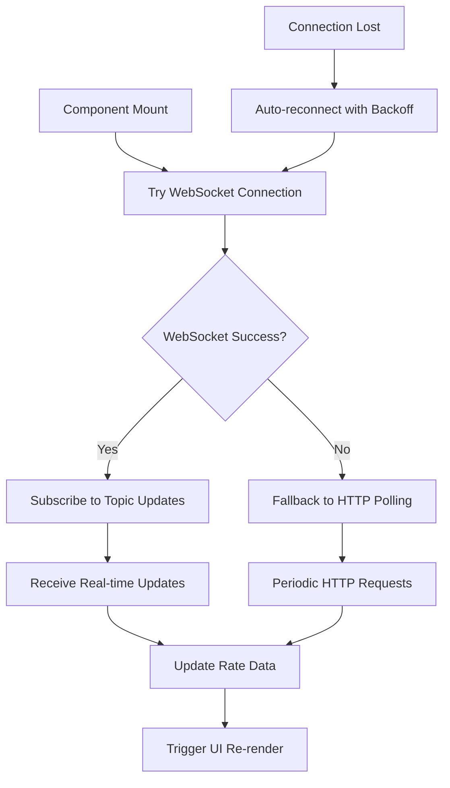

# Sistema de Rate Dinámico USDC ↔ hUSD en Hedera

Este documento describe la implementación del sistema de exchange rate dinámico para el protocolo Valora, que permite intercambios en tiempo real entre USDC y hUSD utilizando Hedera Consensus Service como fuente única de verdad.

## Arquitectura General

### Frontend (React/Next.js)

-   **Hook de Rate en Tiempo Real**: `useRealTimeRate.ts` (WebSocket + HTTP fallback)
-   **Componente de Visualización**: `RealTimeRateDisplay.tsx`
-   **Modal de Conflicto**: `RateConflictModal.tsx`
-   **Integración en Trading Interface**: Actualización automática del UI

### Backend (API Routes)

-   **Validación de Rate**: Verificación contra Hedera topic en cada transacción
-   **Endpoints actualizados**: `/api/deposit/init` y `/api/deposit`
-   **Servicio de Rate**: `HederaRateService.ts`

## Componentes Principales

### 1. Hook useRealTimeRate (WebSocket Implementation)

```typescript
// Ubicación: src/hooks/useRealTimeRate.ts
export function useRealTimeRate(): UseRealTimeRateReturn {
    // WebSocket connection to Mirror Node with HTTP fallback
    // Real-time notifications from Hedera topic
    // Automatic reconnection with exponential backoff
    // Tab visibility optimization
}
```

**Características:**

-   **WebSocket Connection**: Conexión directa al Mirror Node de Hedera (`wss://testnet.mirrornode.hedera.com/v1/subscribe`)
-   **HTTP Fallback**: Si WebSocket falla, usa polling HTTP como respaldo
-   **Real-time Updates**: Notificaciones instantáneas cuando hay nuevos mensajes en el topic
-   **Auto-reconnection**: Reconexión automática con backoff exponencial
-   **Resource Management**: Pausa conexiones cuando el tab está oculto
-   **Heartbeat**: Mantiene la conexión WebSocket activa

### 2. Flujo de Conexión



**Ventajas sobre Polling:**

-   ✅ **Instant Updates**: Recibe updates inmediatamente cuando se publica un nuevo rate
-   ✅ **Reduced API Load**: No bombardea la API con requests constantes
-   ✅ **Better Performance**: Menor uso de ancho de banda
-   ✅ **Scalable**: Soporta múltiples usuarios simultáneos sin sobrecargar el servidor

## Implementación Técnica

### WebSocket Subscription Flow

1. **Initial Connection**:

```typescript
const wsRef = useRef<WebSocket | null>(null)
wsRef.current = new WebSocket(
    'wss://testnet.mirrornode.hedera.com/v1/subscribe'
)
```

2. **Topic Subscription**:

```typescript
const subscribeMessage = {
    type: 'subscribe',
    filter: {
        entity: '0.0.6626120', // Topic ID
        event: 'topic_message',
    },
}
wsRef.current.send(JSON.stringify(subscribeMessage))
```

3. **Message Handling**:

```typescript
wsRef.current.onmessage = (event) => {
    const data = JSON.parse(event.data)
    if (data.type === 'topic_message') {
        // Fetch latest rate via HTTP API for data consistency
        fetchLatestRateHTTP().then(updateRateData)
    }
}
```

### Hybrid Approach: WebSocket + HTTP

La implementación usa un enfoque híbrido:

1. **WebSocket**: Para notificaciones en tiempo real de cambios en el topic
2. **HTTP API**: Para obtener los datos actuales del rate con parsing completo
3. **Fallback**: Si WebSocket falla, continúa con HTTP polling

**Ventajas del Enfoque Híbrido:**

-   Notificaciones instantáneas via WebSocket
-   Datos consistentes y validados via HTTP API
-   Fallback robusto si WebSocket no está disponible
-   Reutiliza la lógica de parsing existente del backend

### Rate Conflict Management

El sistema maneja conflictos de rate de manera elegante:

```typescript
// Frontend detecta conflicto HTTP 409
if (response.status === 409) {
    setRateConflictData({
        currentRate: errorData.currentRate,
        submittedRate: errorData.submittedRate,
        usdcAmount: amountNum,
    })
    setShowRateConflict(true) // Muestra modal
}
```

### Optimizaciones de Performance

1. **Tab Visibility API**:

```typescript
document.addEventListener('visibilitychange', () => {
    if (document.hidden) {
        wsRef.current?.close() // Ahorra recursos
    } else {
        connectWebSocket() // Reconecta al volver
    }
})
```

2. **Heartbeat Mechanism**:

```typescript
const sendHeartbeat = () => {
    wsRef.current?.send(JSON.stringify({ type: 'ping' }))
    setTimeout(sendHeartbeat, 25000) // Cada 25 segundos
}
```

3. **Connection Timeout**:

```typescript
setTimeout(() => {
    if (!isConnected) {
        console.log('WebSocket timeout, falling back to HTTP')
        fetchLatestRateHTTP()
    }
}, 30000) // 30 segundos
```

## Configuración

### Variables de Entorno

```env
# Backend (.env.local)
TOPIC_ID=0.0.6626120
OPERATOR_ID=0.0.xxxxx
OPERATOR_KEY=302e0201xxx...
TREASURY_ID=0.0.xxxxx
USDC_TOKEN_ID=0.0.429274
HUSD_TOKEN_ID=0.0.6624255
```

### WebSocket Endpoints

-   **Testnet**: `wss://testnet.mirrornode.hedera.com/v1/subscribe`
-   **Mainnet**: `wss://mainnet.mirrornode.hedera.com/v1/subscribe`

## Monitoreo y Debugging

### Frontend Logs

```javascript
// WebSocket connection status
console.log('✅ WebSocket connected to Mirror Node')
console.log('📨 Received WebSocket topic message update')
console.log('📊 Rate updated via WebSocket notification')

// Fallback activation
console.log('🔄 WebSocket timeout, falling back to HTTP')
console.log('🔄 Max retries reached, using HTTP fallback')
```

### Performance Metrics

-   **WebSocket Latency**: ~100-500ms para updates
-   **HTTP Fallback**: ~1-2 segundos para requests
-   **Connection Overhead**: Mínimo después de la conexión inicial
-   **Resource Usage**: Optimizado para múltiples tabs

## Testing

### Manual Testing

1. Abrir la aplicación en el navegador
2. Verificar conexión WebSocket en DevTools (Network tab)
3. Publicar un nuevo rate en el topic de Hedera
4. Observar update instantáneo en la UI

### Error Scenarios

1. **WebSocket failure**: Debe fallar graciosamente a HTTP
2. **Network interruption**: Debe reconectar automáticamente
3. **Rate conflicts**: Debe mostrar modal de conflicto
4. **Tab switching**: Debe pausar/reanudar conexiones

## Futuras Mejoras

### 1. Server-Sent Events (SSE)

-   Alternativa a WebSocket más simple
-   Mejor soporte en algunos navegadores

### 2. Service Worker Integration

-   Updates en background aunque el tab esté cerrado
-   Notificaciones push para cambios importantes

### 3. Rate Prediction

-   ML models para predecir cambios de rate
-   Alertas proactivas de volatilidad

### 4. Multi-Topic Support

-   Suscripción a múltiples topics simultáneamente
-   Agregación de datos de diferentes fuentes

## Beneficios de la Implementación

✅ **Real-time**: Updates instantáneos sin polling
✅ **Efficient**: Menor carga en el servidor y red
✅ **Scalable**: Soporta muchos usuarios simultáneos
✅ **Robust**: Fallback automático si WebSocket falla
✅ **User-friendly**: UX fluida con updates transparentes
✅ **Resource-conscious**: Optimizado para múltiples tabs

### 2. Componente RealTimeRateDisplay

```typescript
// Ubicación: src/components/real-time-rate-display.tsx
export function RealTimeRateDisplay({ showDetails = false }: Props) {
    // Indicadores visuales de conexión
    // Rate en tiempo real con formateo preciso
    // Detalles del timestamp y sequence number
}
```

**Características:**

-   Indicador visual del estado de conexión
-   Rate displayed con 6 decimales de precisión
-   Información de sequence number y timestamp
-   Botón de refresh manual
-   Estados de loading, error y conectado

### 3. Modal de Conflicto de Rate

```typescript
// Ubicación: src/components/rate-conflict-modal.tsx
export function RateConflictModal({
    currentRate,
    submittedRate,
    usdcAmount,
}: Props) {
    // Comparación visual de rates
    // Cálculo del impacto en la transacción
    // Opciones para aceptar o cancelar
}
```

**Características:**

-   Comparación side-by-side de rates
-   Cálculo automático del impacto en hUSD recibido
-   Indicadores visuales de cambio (↑↓)
-   Opciones claras para continuar o cancelar

## Flujo de Validación del Rate

### 1. Frontend - Preparación

```typescript
// El usuario ingresa cantidad en USDC
// Se calcula automáticamente la cantidad hUSD usando el rate actual
// Se preparan los datos del rate para envío al backend
const payload = {
    userAccountId: '0.0.12345',
    amount: 100000000, // USDC en unidades mínimas
    expectedRate: 1.005432,
    rateSequenceNumber: '12345',
    rateTimestamp: '1625097600.123456789',
}
```

### 2. Backend - Validación

```typescript
// API endpoint valida el rate contra Hedera topic
const rateService = new HederaRateService()
const latestRate = await rateService.getLatestRate()

// Verifica coincidencia exacta de sequence number y rate
const rateMatches =
    latestRate.sequenceNumber === rateSequenceNumber &&
    Math.abs(latestRate.rate - expectedRate) < 0.0001

if (!rateMatches) {
    // Retorna HTTP 409 con detalles del nuevo rate
    return res.status(409).json({
        error: 'Rate has changed',
        currentRate: latestRate,
        submittedRate: { rate: expectedRate, sequenceNumber, timestamp },
    })
}
```

### 3. Frontend - Manejo de Conflictos

```typescript
// Si el backend retorna 409, se muestra el modal
if (response.status === 409) {
    const errorData = await response.json()
    setRateConflictData({
        currentRate: errorData.currentRate,
        submittedRate: errorData.submittedRate,
        usdcAmount: amountNum,
    })
    setShowRateConflict(true)
}
```

## Configuración

### Variables de Entorno Requeridas

```env
# Backend (.env.local)
TOPIC_ID=0.0.6626120
OPERATOR_ID=0.0.xxxxx
OPERATOR_KEY=302e0201xxx...
TREASURY_ID=0.0.xxxxx
USDC_TOKEN_ID=0.0.429274
HUSD_TOKEN_ID=0.0.6624255
```

### Constantes del Frontend

```typescript
// src/app/constants.ts
export const TOPIC_ID = '0.0.6626120'
export const TESTNET_MIRROR_NODE_ENDPOINT =
    'https://testnet.hedera.validationcloud.io/v1'
```

## Endpoints de API

### GET /api/get-latest-rate

-   **Función**: Obtiene el último rate del topic de Hedera
-   **Respuesta**: `{ rate, timestamp, sequenceNumber, details }`
-   **Uso**: Utilizado por el hook `useRealTimeRate`

### POST /api/deposit/init

-   **Función**: Inicializa un depósito con validación de rate
-   **Parámetros**: `userAccountId, amount, expectedRate, rateSequenceNumber, rateTimestamp`
-   **Validación**: Verifica rate contra topic antes de crear la transacción programada
-   **Respuesta**: `scheduleId, amountHUSDC, rate` o error 409 si rate cambió

### POST /api/deposit

-   **Función**: Completa el depósito (endpoint legacy, mantenido para compatibilidad)
-   **Validación**: También incluye verificación de rate

## Casos de Uso

### 1. Operación Normal

1. Usuario conecta wallet
2. Rate se carga automáticamente en tiempo real
3. Usuario ingresa cantidad USDC
4. Se calcula hUSD automáticamente
5. Usuario confirma transacción
6. Backend valida rate y procesa

### 2. Rate Cambia Durante Transacción

1. Usuario inicia transacción con rate 1.005
2. Entre frontend y backend, rate cambia a 1.006
3. Backend detecta conflicto y retorna 409
4. Frontend muestra modal con:
    - Rate anterior: 1.005
    - Rate nuevo: 1.006
    - Impacto en hUSD recibido
5. Usuario puede aceptar nuevo rate o cancelar

### 3. Pérdida de Conexión

1. Polling falla por problema de red
2. Hook implementa retry con backoff exponencial
3. UI muestra estado de "desconectado"
4. Usuario puede hacer refresh manual
5. Cuando la conexión se restaura, continúa el polling

## Consideraciones de Seguridad

### 1. Validación Dual

-   Frontend: UI actualizado en tiempo real
-   Backend: Validación final contra la fuente de verdad (topic de Hedera)

### 2. Ventana de Tolerancia

-   Se permite diferencia mínima de 0.0001 en el rate para manejar diferencias de punto flotante
-   Sequence number debe coincidir exactamente

### 3. Timeout de Transacciones

-   Rates antiguos se rechazan automáticamente
-   Usuario debe usar el rate más reciente

## Monitoreo y Debugging

### Logs del Frontend

```javascript
console.log('Rate updated:', {
    oldRate: prevData?.rate,
    newRate: newRateData.rate,
    sequenceNumber: newRateData.sequenceNumber,
})
```

### Logs del Backend

```javascript
console.log('Rate validation successful:', {
    rate: latestRate.rate,
    sequenceNumber: latestRate.sequenceNumber,
})
```

### Debug Mode

-   Agregar `?debug=true` a `/api/get-latest-rate` para ver mensajes raw del topic

## Performance

### Optimizaciones Implementadas

-   Polling inteligente (pausa en tabs ocultos)
-   Actualización solo con datos nuevos
-   Retry con backoff exponencial
-   Timeouts configurables

### Métricas Típicas

-   Latencia de actualización: ~10 segundos máximo
-   Tiempo de validación en backend: <2 segundos
-   Tamaño de payload de rate: ~200 bytes

## Futuras Mejoras

### 1. WebSocket Real-time

-   Reemplazar polling con WebSocket para updates instantáneos
-   Requerirá soporte del Mirror Node o servicio intermedio

### 2. Cache de Rates

-   Implementar cache Redis para rates recientes
-   Reducir llamadas al Mirror Node

### 3. Predicción de Rates

-   Mostrar tendencia de cambio de rates
-   Alertas proactivas de volatilidad

### 4. Fallback Mechanisms

-   Múltiples fuentes de rate para redundancia
-   Rate estimado basado en histórico en caso de falla del topic
