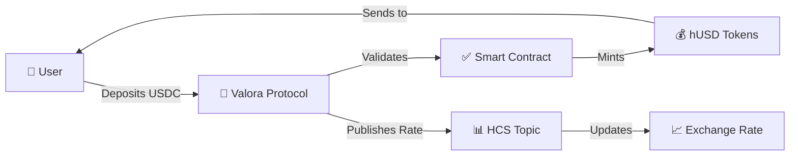

<div align="center">

# 🏦 Valora Protocol

### **The Next Generation DeFi Liquidity Protocol on Hedera**

[](https://opensource.org/licenses/MIT)
[](https://nextjs.org/)
[](https://hedera.com/)
[](https://www.typescriptlang.org/)


**Transform your USDC into yield-bearing hUSD tokens with complete transparency and security**

[🚀 Launch App](http://localhost:3000) • [💬 Discord](https://discord.gg) • [🐦 Twitter](https://twitter.com/valoraprotocol)

</div>

---

## 🌟 **Why Valora Protocol?**

<table>
<tr>
<td width="33%" align="center">

### ⚡ **Lightning Fast**


Powered by Hedera's 10,000+ TPS capability with instant finality

</td>
<td width="33%" align="center">

### 🔒 **Bank-Grade Security**


aBFT consensus with enterprise-grade security standards

</td>
<td width="33%" align="center">

### 💎 **Transparent & Auditable**


Every transaction verifiable on-chain via HCS

</td>
</tr>
</table>

---

## 🎯 **Key Features**

### 🪙 **Liquid Yield Tokens**

> Convert USDC to hUSD - a yield-bearing token that automatically accrues value over time

### 📈 **Dynamic Exchange Rate**

> Real-time rate updates published to Hedera Consensus Service for complete transparency

### 🔄 **Seamless Integration**

> One-click deposits with support for major Hedera wallets

### 📱 **Modern Interface**

> Beautiful, responsive UI optimized for both desktop and mobile

---

## 🛠️ **Technology Stack**

<div align="center">

| Layer              | Technologies                                                                                                                                                                                                                                                                                                                                                                                                 |
| ------------------ | ------------------------------------------------------------------------------------------------------------------------------------------------------------------------------------------------------------------------------------------------------------------------------------------------------------------------------------------------------------------------------------------------------------ |
| **Frontend**       |     |
| **Blockchain**     |                                                                                                                                                                                                                                      |
| **Testing**        |                                                                                                                                                                                               |
| **Infrastructure** |                                                                                                                                                                                                                   |

</div>

---

## 🚀 **Quick Start**

### Prerequisites

```bash
✅ Node.js v18+
✅ pnpm (recommended) or npm
✅ Hedera Testnet Account
```

### 🔧 Installation

```bash
# Clone the repository
git clone https://github.com/valora-protocol/front-valora
cd front-valora-protocol

# Install dependencies
pnpm install

# Configure environment
cp .env.example .env.local
# Edit .env.local with your credentials

# Start development server
pnpm dev
```

### 🧪 Testing

```bash
# Run all tests
pnpm test

# Run with coverage
pnpm test:coverage

# Run specific test suite
pnpm test -- deposit.test.ts
```

---

## 📁 **Project Architecture**

```
FRONT-VALORA-PROTOCOL/
│
├── 📂 src/
│   ├── 📱 app/              # Next.js app router pages
│   │   ├── defi/           # DeFi dashboard
│   │   ├── portfolio/      # User portfolio
│   │   ├── transparency/   # Protocol transparency
│   │   └── vault/          # Vault management
│   ├── 🎨 components/       # Reusable UI components
│   ├── 🔧 services/         # Business logic & Hedera integration
│   └── 📚 lib/             # Utility functions
│
├── 🌐 pages/api/           # API endpoints
│   ├── deposit.ts          # USDC deposit handler
│   ├── publish-rate.ts     # Exchange rate publisher
│   └── get-latest-rate.ts  # Rate fetcher
│
├── 🧪 __tests__/           # Test suites
│   ├── api/               # API tests
│   └── services/          # Service tests
│
└── 📋 docs/
    ├── README_BACKEND.md   # Backend documentation
    └── EXAMPLES.md        # API usage examples
```

---

## 💡 **How It Works**

<div align="center">



</div>

### **Step-by-step Process:**

1. **🔗 Connect Wallet** - Link your Hedera-compatible wallet
2. **💵 Deposit USDC** - Enter amount and confirm transaction
3. **⚙️ Protocol Processing** - Smart contract validates and processes
4. **🪙 Receive hUSD** - Liquid yield tokens sent to your wallet
5. **📈 Earn Yield** - Automatic value accrual based on protocol performance

---

## 🔐 **Security & Audits**

### 🛡️ **Security Features**

-   ✅ **Multi-signature Treasury**
-   ✅ **Rate limiting on deposits**
-   ✅ **Automated security monitoring**
-   ✅ **Emergency pause functionality**
-   ✅ **Comprehensive test coverage (95%+)**

---

## 📈 **Roadmap**

### **Q4 2025** ✅

-   [x] Protocol launch on mainnet
-   [x] Initial liquidity provision
-   [x] Wallet integrations

---

## 📞 **Support & Community**

<div align="center">

| Platform    | Link                                                  |
| ----------- | ----------------------------------------------------- |
| **Discord** | [Join our community](https://discord.gg/valora)       |
| **Twitter** | [@ValoraProtocol](https://twitter.com/valoraprotocol) |

</div>

---

## 📜 **License**

This project is licensed under the MIT License - see the [LICENSE](LICENSE) file for details.

---

<div align="center">

### **Built with ❤️ by the Valora Team**

⭐ **Star us on GitHub** — it helps!

[🏠 Website](http://localhost:3000) • [🐛 Report Bug](https://github.com/valora-protocol/issues) • [✨ Request Feature](https://github.com/valora-protocol/issues)

</div>
