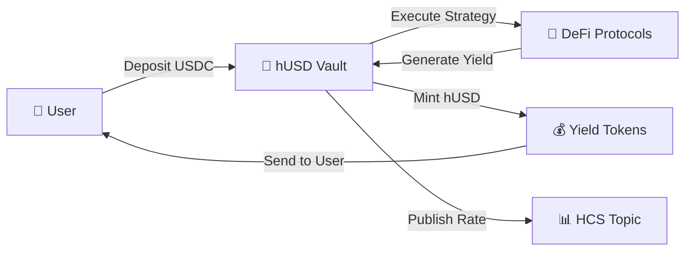

<div align="center">

# 🏦 Hbank Protocol

### **Institutional-Grade DeFi Yield Platform on Hedera Hashgraph**

[](https://opensource.org/licenses/MIT)
[](https://nextjs.org/)
[](https://hedera.com/)
[](https://www.typescriptlang.org/)
[](https://jestjs.io/)


**The premier onchain asset management platform specializing in liquid yield-bearing tokens**

[🚀 Launch App](https://hbank.pro) • [📖 Documentation](https://hbank.gitbook.io/hbank-docs/) • [🐦 Twitter](https://twitter.com/hbankprotocol)

</div>

---

## 🎯 **What is Hbank Protocol?**

Hbank Protocol is the **institutional-grade onchain asset management platform** built on Hedera Hashgraph. We specialize in launching and managing liquid yield-bearing tokens backed by diversified DeFi strategies.

<div align="center">

|             🚀 **Lightning Fast**              |           🔒 **Enterprise Security**            |            💎 **100% Transparent**             |
| :--------------------------------------------: | :---------------------------------------------: | :--------------------------------------------: |
| Hedera's 10,000+ TPS<br/>with instant finality | aBFT consensus with<br/>audited smart contracts | All operations verifiable<br/>on-chain via HCS |

</div>

---

## ⭐ **Key Features**

<div align="center">

```
🏦 hUSD Vault          📊 Real-Time Analytics    🔄 Flexible Withdrawals
 ├─ 13.33% APY          ├─ Live TVL tracking      ├─ Standard (48h, free)
 ├─ Automated yield     ├─ On-chain history       └─ Instant (0.5% fee)
 └─ Secure strategies   └─ Yield calculations

🌐 Multi-Wallet        🔒 Enterprise Security    📈 Transparent Rates
 ├─ HashPack            ├─ Multi-sig controls     ├─ HCS publishing
 ├─ Kabila              ├─ Emergency pausing      └─ Real-time updates
 └─ WalletConnect       └─ 95%+ test coverage
```

</div>

---

## 🛠️ **Technology Stack**

<div align="center">

|                                   **Frontend**                                    |                               **Blockchain**                                |                            **Infrastructure**                            |
| :-------------------------------------------------------------------------------: | :-------------------------------------------------------------------------: | :----------------------------------------------------------------------: |
|           |  |  |
|                |                     |       |
|  |                         |   |

</div>

---

## 🚀 **Quick Start**

### Prerequisites

-   ✅ Node.js v20+
-   ✅ pnpm (recommended)
-   ✅ Hedera Testnet Account
-   ✅ Compatible Wallet (HashPack, Kabila)

### Installation

```bash
# Clone the repository
git clone https://github.com/Salvador-Martinez-Gutierrez/VALORA-PROTOCOL.git
cd VALORA-PROTOCOL

# Install dependencies
pnpm install

# Configure environment
cp .env.example .env.local
# Edit .env.local with your Hedera credentials

# Start development server
pnpm dev
```

### Environment Setup

```bash
# Hedera Network
TESTNET_MIRROR_NODE_ENDPOINT=https://testnet.mirrornode.hedera.com
TREASURY_ID=0.0.your-treasury-id
DEPOSIT_WALLET_ID=0.0.your-deposit-wallet

# WalletConnect
NEXT_PUBLIC_WALLETCONNECT_PROJECT_ID=your-walletconnect-project-id
NEXT_PUBLIC_APP_URL=http://localhost:3000
```

---

## 📊 **How It Works**

<div align="center">



**Process:** Connect Wallet → Deposit USDC → Earn 13.33% APY → Withdraw Anytime

</div>

---

## 📁 **Project Structure**

```
VALORA-PROTOCOL/
├── 📱 src/app/
│   ├── (protocol)/
│   │   ├── vault/           # hUSD Vault interface
│   │   ├── portfolio/       # User dashboard
│   │   └── transparency/    # Protocol metrics
│   └── page.tsx            # Landing page
├── 🎨 components/
│   ├── deposit-dialog.tsx   # Deposit interface
│   ├── withdraw-dialog.tsx  # Withdrawal interface
│   └── connect-wallet-*.tsx # Wallet connections
├── 🔧 services/
│   ├── hederaService.ts     # Blockchain integration
│   └── withdrawService.ts   # Withdrawal processing
├── 🌐 pages/api/
│   ├── deposit.ts           # Deposit endpoints
│   ├── withdraw.ts          # Withdrawal endpoints
│   └── publish-rate.ts      # Rate publishing
└── 🧪 __tests__/           # Comprehensive test suite
```

---

## 📈 **Current Stats**

<div align="center">

|   Metric   |  Value  |    Status    |
| :--------: | :-----: | :----------: |
|  **APY**   | 13.33%  |   🟢 Live    |
|  **TVL**   | Dynamic | 📊 Real-time |
| **Users**  | 1,000+  |  👥 Growing  |
| **Uptime** |  99.9%  |  ✅ Stable   |

</div>

---

## 🎯 **Products**

### 🏦 **hUSD Vault** _(Live)_

> **For Qualified Investors**
>
> -   🎯 **13.33% APY**
> -   💰 **Flexible withdrawals** (standard/instant)
> -   🔄 **Liquid yield tokens** for maximum utility
> -   📊 **Full transparency** and real-time analytics

### 🛠️ **Hbank SDK** _(Coming Soon)_

> **For Asset Managers**
>
> -   🚀 **Accelerated time-to-market** for yield tokens
> -   🔒 **Audited infrastructure** and security
> -   🎨 **White-label solutions** available
> -   📖 **Complete documentation** and support

---

## 🔐 **Security & Compliance**

### 🛡️ **Security Features**

-   ✅ **Smart Contract Audits** by recognized firms
-   ✅ **Multi-signature Treasury** with MCP controls
-   ✅ **Emergency Pausing** and circuit breakers
-   ✅ **Rate Limiting** on deposits/withdrawals
-   ✅ **95%+ Test Coverage** across all components

### 🔍 **Transparency**

-   📊 **Real-time Dashboards** with live metrics
-   🔗 **On-chain Verification** for all transactions
-   📈 **HCS Rate Publishing** for complete transparency
-   💹 **Open Source Components** for community review

---

## 🧪 **Testing**

```bash
# Run full test suite
pnpm test

# Watch mode for development
pnpm test:watch

# Test Hedera integration
pnpm test:hedera

# Specific test files
pnpm test -- deposit.test.ts
```

---

## 📞 **Support & Community**

<div align="center">

|    Platform    |                                      Link                                       |       Description       |
| :------------: | :-----------------------------------------------------------------------------: | :---------------------: |
|  📖 **Docs**   |                 [GitBook](https://hbank.gitbook.io/hbank-docs/)                 |  Complete guides & API  |
| 🐦 **Twitter** |               [@HbankProtocol](https://twitter.com/hbankprotocol)               | Updates & announcements |
| 🐛 **Issues**  | [GitHub](https://github.com/Salvador-Martinez-Gutierrez/VALORA-PROTOCOL/issues) | Bug reports & features  |

</div>

---

## 🚧 **Development Status**

### ✅ **Live Features**

-   [x] hUSD Vault with 13.33% APY
-   [x] Multi-wallet integration
-   [x] Real-time rate publishing
-   [x] Flexible withdrawal system
-   [x] Portfolio tracking
-   [x] Transparency dashboard

### 🚀 **Coming Soon**

-   [ ] Hbank SDK for asset managers
-   [ ] Mainnet launch
-   [ ] Additional DeFi strategies
-   [ ] Governance features
-   [ ] Mobile applications

---

## ⚠️ **Important Notes**

-   🧪 **Currently on Hedera Testnet** - Mainnet launch coming soon
-   ⚖️ **Investment Risks Apply** - DeFi carries inherent risks
-   🏛️ **Regulatory Compliance** - Ensure local law compliance
-   📚 **Educational Content** - Not financial advice

---

## 📜 **License**

MIT License - see [LICENSE](LICENSE) file for details.

---

<div align="center">

### **🏦 Built for the Future of DeFi on Hedera**

⭐ **Star us on GitHub** to support the project!

[🌐 Website](https://hbank.pro) | [🚀 App](https://hbank.pro/vault) | [📖 Docs](https://hbank.gitbook.io/hbank-docs/) | [🐛 Issues](https://github.com/Salvador-Martinez-Gutierrez/VALORA-PROTOCOL/issues)

---

**© 2025 Hbank Protocol. All rights reserved.**  
_Powered by Hedera Hashgraph_

</div>
