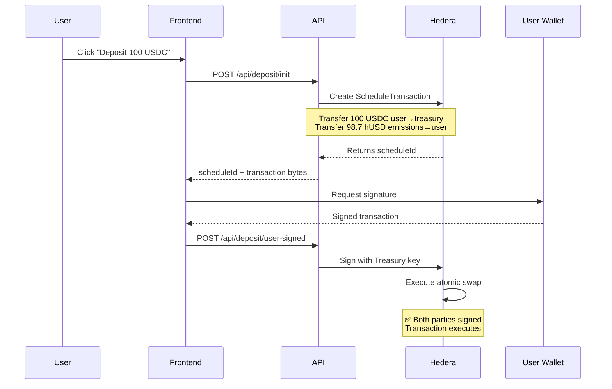

<div align="center">

# 🏦 HBANK

### **The Onchain Neobank on Hedera Hashgraph**

[](https://opensource.org/licenses/MIT)
[](https://nextjs.org/)
[](https://hedera.com/)
[](https://www.typescriptlang.org/)
[](https://supabase.com/)


[🚀 Launch App](https://hbank.cash)• [🔈 Pitch](https://drive.google.com/file/d/1Ho4N9kTXHvQ7RiAvBBnApqd_rFIz1Myp/view?usp=sharing)  • [📖 Docs](https://hbank.gitbook.io/hbank-docs/) • [🐦 Twitter](https://twitter.com/hbankcash)

</div>

---

## 🎯 **What is Hbank?**

HBank is the fully onchain, self-custodial neobank built on Hedera Hashgraph. We provide a complete suite of financial services including liquid yield tokens for earning passive income, a multi-wallet portfolio tracker, crypto swaps through aggregated liquidity, and a credit card for seamless spending. Unlike traditional neobanks, you maintain full custody of your assets with complete transparency and verifiability on-chain.

---

## ⚡ **Core Products**

### 🏦 **hUSD Vault (/earn) - Liquid Yield Tokens** (TESTNET)

**What it does:**
- Deposit USDC and receive **hUSD** (yield-bearing asset) at current exchange rate
- Earn **13.33% APY** from DeFi strategy allocations (current mocked APY)
- Withdraw anytime via **Instant (0.5% fee)** or **Standard (48h, free)** methods

**Decentralization Mechanisms:**
```
✅ Scheduled Transactions (HTS)
   └─ All deposits use Hedera Scheduled Transactions requiring multi-party signatures
   └─ User must sign their transaction, server provides counter-signature

✅ Rate Publishing (HCS)
   └─ Exchange rates published to Hedera Consensus Service (HCS) public topic
   └─ All rate changes are immutably recorded on-chain with timestamps
   └─ Anyone can verify historical rates and calculations

✅ On-Chain Withdrawal Requests
   └─ Standard withdrawals are published to HCS withdrawal topic
   └─ 48-hour timelock enforced on-chain before processing
   └─ Complete audit trail of all withdrawal requests/results

✅ Multi-Wallet Treasury System
   └─ Separate wallets for deposits, emissions, instant/standard withdrawals
   └─ Transparent wallet balances viewable on /earn/transparency page
```

**Technical Implementation:**
- **Deposit Flow**: `initializeDeposit()` → Creates HTS scheduled transaction → User signs → `completeTreasurySignature()` → Atomic swap (USDC ↔ hUSD)
- **Rate Management**: `HederaRateService` fetches latest rates from HCS topic, validates sequence numbers for consistency
- **Withdrawal Processing**: `WithdrawService` publishes requests to HCS, automated cron processes after timelock

### 📊 **Portfolio Tracker (/portfolio) - Multi-Wallet Asset Tracking** (TESTNET AUTH + MAINNET WALLET TRACKING)

**What it does:**
- Add up to 5 mainnet Hedera wallet addresses (0.0.xxxxx format)
- Track **fungible tokens** with real-time prices from SaucerSwap
- Monitor **DeFi positions**: SaucerSwap V1 pools/farms, Bonzo Finance lending
- View **NFT collections** with IPFS metadata resolution
- Aggregate view across all wallets or individual wallet breakdown

**Decentralization Mechanisms:**
```
✅ Signature-Based Authentication (No Passwords)
   └─ Portfolio access secured by signing a nonce with your Hedera wallet
   └─ Zero-knowledge proof: server verifies signature without storing private keys
   └─ JWT tokens with short expiration for session management

✅ Direct On-Chain Data Fetching
   └─ All balance data fetched from Validation Cloud Hedera Mirror Node
   └─ No intermediary databases for critical balance information
   └─ Real-time sync with mainnet state

✅ Open APIs for DeFi Data
   └─ SaucerSwap public API for DEX positions
   └─ Bonzo Finance API for lending positions
   └─ Transparent third-party data sources, verifiable by anyone

✅ Client-Side Price Updates
   └─ WebSocket connections for real-time price feeds
   └─ Prices update every 10 seconds without backend intervention
```

**Technical Implementation:**
- **Authentication**: `usePortfolioAuth()` → Generates nonce → User signs with wallet → `portfolioAuthService` verifies ED25519 signature
- **Wallet Sync**: `syncWalletTokens()` → Queries Hedera Mirror Node `/accounts/{id}` → Categorizes fungible/NFT/LP tokens → Fetches DeFi positions
- **NFT Metadata**: IPFS URIs decoded from base64 → Fetched via IPFS gateway → Images and properties displayed
- **DeFi Tracking**: Detects LP tokens (ssLP prefix) → Queries pool reserves → Calculates user's share of liquidity

---

## 🛠️ **Technology Stack**

<div align="center">

### **Frontend Architecture**

|                                   Technology                                    |                Purpose                 |
| :-----------------------------------------------------------------------------: | :------------------------------------: |
|           |       React framework with SSR/ISR        |
|                |            UI component library            |
|  |          Type-safe development          |
|    |         Utility-first CSS styling         |
|          | Accessible component primitives |

### **Blockchain Integration - Hedera SDK**

|                             Technology                             |                       Purpose                        |
| :----------------------------------------------------------------: | :--------------------------------------------------: |
|  | **Core blockchain interactions** |
|       `@hashgraph/sdk` <br/> **HTS (Token Service)**       | Create/transfer fungible tokens (USDC, hUSD) |
|         `ScheduleCreateTransaction` <br/> **HTS**         | Multi-signature atomic swaps for deposits |
|    `TopicMessageSubmitTransaction` <br/> **HCS**    | Publish rates & withdrawals to public topics |
|         `AccountBalanceQuery` <br/> **Queries**         | Check token balances before transactions |
|  `@buidlerlabs/hashgraph-react-wallets`   | HashPack, Kabila, Blade wallet integration |

### **Backend & Database**

|                                Technology                                 |                   Purpose                    |
| :-----------------------------------------------------------------------: | :------------------------------------------: |
|  |   Serverless API endpoints (Vercel Edge)   |
|     | User data, wallet tracking, portfolio state |
|      |         Runtime schema validation         |
|            |           JWT token management            |

### **Data Sources**

|                           Source                           |                       Purpose                        |
| :--------------------------------------------------------: | :--------------------------------------------------: |
|       **Hedera Mirror Node** <br/> Validation Cloud       | Token balances, transaction history (mainnet data) |
|         **SaucerSwap API** <br/> GraphQL + REST         |   Token prices, LP pool reserves, farm positions   |
| **Bonzo Finance API** <br/> REST | Lending/borrowing positions, APY data |
|           **IPFS Gateways** <br/> ipfs.io           |          NFT metadata & image resolution          |

</div>

---

## 📁 **Project Architecture**

```
HBANK-PROTOCOL/
│
├── 📱 src/app/                        # Next.js App Router
│   ├── (protocol)/                   # Protected routes group
│   │   ├── earn/                     # hUSD Vault Page
│   │   │   ├── page.tsx              # Main trading interface
│   │   │   ├── components/
│   │   │   │   ├── trading-interface.tsx      # Mint/Redeem UI
│   │   │   │   ├── mint-action-button.tsx     # Deposit flow handler
│   │   │   │   └── redeem-action-button.tsx   # Withdrawal handler
│   │   │   ├── transparency/         # On-chain verification page
│   │   │   │   └── components/
│   │   │   │       ├── wallet-tracking-card.tsx  # Treasury balances
│   │   │   │       └── instant-redemption-card.tsx # Capacity display
│   │   │   └── hooks/
│   │   │       ├── useRealTimeRate.tsx        # HCS rate subscription
│   │   │       └── useTokenBalances.tsx       # User balances
│   │   │
│   │   └── portfolio/                # Multi-Wallet Tracker
│   │       ├── page.tsx              # Portfolio dashboard
│   │       └── components/           # (uses shared components/)
│   │
│   └── providers/
│       └── wallet-provider.tsx       # Hedera wallet context
│
├── 📦 components/                     # Shared React components
│   ├── connect-wallet-button.tsx     # Multi-wallet connection
│   ├── wallet-card.tsx               # Individual wallet display
│   ├── aggregated-portfolio-view.tsx # Cross-wallet aggregation
│   ├── asset-sections.tsx            # Token/DeFi/NFT sections
│   └── deposit-dialog.tsx            # Deposit modal with rate lock
│
├── 🔧 services/                       # Business logic layer
│   ├── hederaService.ts              # 🌟 Core Hedera SDK wrapper
│   │   ├── publishRate()             # HCS rate publishing
│   │   ├── scheduleDeposit()         # HTS scheduled transactions
│   │   ├── createScheduledHUSDTransfer()  # Withdrawal scheduling
│   │   └── verifyHUSDTransfer()      # Mirror Node verification
│   │
│   ├── depositService.ts             # Deposit workflow orchestration
│   │   ├── initializeDeposit()       # Create scheduled tx
│   │   └── completeTreasurySignature() # Counter-sign & execute
│   │
│   ├── withdrawService.ts            # Withdrawal HCS publishing
│   ├── instantWithdrawService.ts     # Instant withdrawal logic
│   ├── hederaRateService.ts          # 🌟 HCS rate topic reader
│   │
│   ├── portfolioWalletService.ts     # Wallet CRUD operations
│   │   └── syncWalletTokens()        # 🌟 Mirror Node sync
│   │       ├── Fetches from Validation Cloud
│   │       ├── Categorizes fungible/LP/NFT
│   │       ├── Resolves IPFS metadata
│   │       └── Syncs DeFi positions
│   │
│   ├── portfolioAuthService.ts       # Signature-based auth
│   ├── saucerSwapService.ts          # DEX data aggregation
│   └── defiService.ts                # Multi-protocol DeFi queries
│
├── 🌐 pages/api/                      # Next.js API routes
│   ├── deposit/
│   │   ├── init.ts                   # POST /api/deposit/init
│   │   └── user-signed.ts            # POST /api/deposit/user-signed
│   ├── withdraw/
│   │   └── instant/
│   │       └── index.ts              # POST /api/withdraw/instant
│   ├── publish-rate.ts               # POST /api/publish-rate (HCS)
│   ├── portfolio/
│   │   ├── auth.ts                   # POST /api/portfolio/auth
│   │   ├── wallets.ts                # GET/POST/DELETE wallets
│   │   ├── sync-tokens.ts            # POST /api/portfolio/sync-tokens
│   │   └── sync-all-wallets.ts       # POST batch sync
│   └── auth/
│       ├── nonce.ts                  # GET /api/auth/nonce
│       └── verify.ts                 # POST /api/auth/verify
│
├── 🔐 lib/                            # Utility libraries
│   ├── hedera-auth.ts                # ED25519 signature verification
│   ├── jwt.ts                        # JWT token management
│   ├── supabase-admin.ts             # Admin database client
│   └── errors.ts                     # Standardized API errors
│
├── 🧪 __tests__/                      # Jest test suite (95%+ coverage)
│   ├── api/
│   │   ├── deposit.test.ts
│   │   └── withdraw.test.ts
│   └── services/
│       ├── hederaService.test.ts
│       └── instantWithdrawService.test.ts
│
└── 📄 Configuration Files
    ├── next.config.ts                # Next.js configuration
    ├── tsconfig.json                 # TypeScript strict mode
    └── jest.config.js                # Test runner setup
```

---

## 🔐 **Decentralization & Transparency Features**

### **1. Hedera Consensus Service (HCS) - Public Audit Trail**

**Rate Publishing Topic:**
```
Topic ID: Configured in TOPIC_ID env variable
Purpose: Publish exchange rates (USDC/hUSD) with metadata
Frequency: On-demand when rates change
Message Format:
{
  "rate": 1.0133,
  "totalUsd": 50000.00,
  "husdSupply": 49343.25,
  "timestamp": "2025-01-15T10:30:00Z",
  "operator": "0.0.xxxxx"
}

Verifiability:
✅ Anyone can query Mirror Node API: /topics/{TOPIC_ID}/messages
✅ Sequence numbers prevent rate manipulation
✅ Timestamps prove historical rate accuracy
```

**Withdrawal Request Topic:**
```
Topic ID: WITHDRAW_TOPIC_ID
Purpose: Immutable withdrawal queue with timelock
Messages:
1. withdraw_request (user initiates)
   - requestId, user, amountHUSD, rate, scheduleId
   - unlockAt: timestamp (48h from request)

2. withdraw_result (system processes)
   - requestId, status (completed/failed), txId
   - processedAt: timestamp

Security:
✅ 48-hour timelock enforced on-chain
✅ Cannot process early (verified by Mirror Node timestamps)
✅ Complete audit trail of all withdrawals
```

### **2. Scheduled Transactions (HTS) - No Unilateral Fund Movement**

**How Deposits Work:**


**Decentralization Guarantee:**
- Server **cannot** move user funds alone (requires user signature)
- User **cannot** mint hUSD alone (requires treasury signature)
- Atomic execution ensures no partial failures

### **3. Signature-Based Authentication - Zero-Knowledge Portfolio Access**

**Portfolio Authentication Flow:**
```typescript
// 1. User requests authentication
const nonce = await generateNonce(accountId) // Random 32-byte hex

// 2. User signs message with their Hedera wallet
const message = `Hbank Portfolio Auth\nNonce: ${nonce}\nAccount: ${accountId}`
const { signature, publicKey } = await wallet.signMessage(message)

// 3. Server verifies signature (no private key needed)
import { PublicKey } from '@hashgraph/sdk'
const pubKey = PublicKey.fromString(publicKey)
const isValid = pubKey.verify(
  Buffer.from(message),
  Buffer.from(signature, 'base64')
)

// 4. Issue JWT token (short-lived, 24h expiration)
const token = await createJWT({ accountId, userId })
```

**Why This Is Decentralized:**
- ✅ No passwords stored in database
- ✅ Server never sees private keys
- ✅ Users retain full custody of credentials
- ✅ Signature proves ownership of Hedera account

### **4. Multi-Wallet Treasury System - Segregated Duties**

| Wallet Type | Purpose | Private Key Held By | Transparency |
|------------|---------|---------------------|--------------|
| **Deposit Wallet** | Receives user USDC deposits | Backend (secured) | Balance shown on /earn/transparency |
| **Emissions Wallet** | Distributes hUSD to users | Backend (secured) | Balance shown on /earn/transparency |
| **Instant Withdraw Wallet** | Pays instant withdrawals (0.5% fee) | Backend (secured) | Real-time capacity display |
| **Standard Withdraw Wallet** | Pays standard withdrawals (after 48h) | Backend (secured) | Balance shown on /earn/transparency |
| **Treasury Wallet** | Holds user hUSD during withdrawal lock | Backend (secured) | Balance shown on /earn/transparency |

**Transparency Page (/earn/transparency):**
- Displays real-time balances of all protocol wallets
- Shows withdrawal capacity (instant withdraw limit)
- Links to Hedera Explorer for on-chain verification

---

## 🚀 **Getting Started**

### **Prerequisites**

```bash
Node.js v20+
pnpm (recommended) or npm
Hedera Testnet Account
Hedera Wallet: HashPack, Kabila, or Blade
Supabase Account (for portfolio tracking)
Validation Cloud API Key (for mainnet data)
```

### **Installation**

```bash
# Clone repository
git clone https://github.com/Salvador-Martinez-Gutierrez/VALORA-PROTOCOL.git
cd HBANK-PROTOCOL

# Install dependencies
pnpm install

# Configure environment variables
cp .env.example .env.local
```

### **Environment Configuration**

```bash
# ===== Hedera Network Configuration =====
USE_REAL_TESTNET=true
TESTNET_MIRROR_NODE_ENDPOINT=https://testnet.mirrornode.hedera.com

# Hedera Operator (rate publisher, admin operations)
OPERATOR_ID=0.0.your-operator-account
OPERATOR_KEY=302e020100300506032b657004220420...

# HCS Topics
TOPIC_ID=0.0.rate-topic-id
WITHDRAW_TOPIC_ID=0.0.withdraw-topic-id

# ===== Token IDs =====
USDC_TOKEN_ID=0.0.usdc-token
HUSD_TOKEN_ID=0.0.husd-token

# ===== Protocol Wallets =====
DEPOSIT_WALLET_ID=0.0.deposit-wallet
DEPOSIT_WALLET_KEY=302e020100300506032b657004220420...

EMISSIONS_ID=0.0.emissions-wallet
EMISSIONS_KEY=302e020100300506032b657004220420...

INSTANT_WITHDRAW_WALLET_ID=0.0.instant-withdraw
INSTANT_WITHDRAW_WALLET_KEY=302e020100300506032b657004220420...

STANDARD_WITHDRAW_WALLET_ID=0.0.standard-withdraw
STANDARD_WITHDRAW_WALLET_KEY=302e020100300506032b657004220420...

TREASURY_ID=0.0.treasury-wallet
TREASURY_KEY=302e020100300506032b657004220420...

# ===== Portfolio Tracking =====
# Validation Cloud (Hedera Mirror Node API)
VALIDATION_CLOUD_API_KEY=your-validation-cloud-key
VALIDATION_CLOUD_BASE_URL=https://mainnet.hedera.validationcloud.io/v1

# Supabase (User data & wallet tracking)
NEXT_PUBLIC_SUPABASE_URL=https://your-project.supabase.co
NEXT_PUBLIC_SUPABASE_ANON_KEY=your-anon-key
SUPABASE_SERVICE_ROLE_KEY=your-service-role-key

# ===== Authentication =====
JWT_SECRET=your-secret-key-min-32-chars
NEXT_PUBLIC_APP_URL=http://localhost:3000

# ===== WalletConnect =====
NEXT_PUBLIC_WALLETCONNECT_PROJECT_ID=your-walletconnect-id
```

### **Run Development Server**

```bash
pnpm dev
# Open http://localhost:3000
```

### **Run Tests**

```bash
# Full test suite
pnpm test

# Watch mode for TDD
pnpm test:watch

# Test Hedera integration
pnpm test:hedera
```

---

## 📖 **How It Works**

### **🏦 hUSD Vault - Deposit Flow**

```
1. User connects Hedera wallet (HashPack/Kabila/Blade)
2. Enter USDC amount to deposit
3. System fetches latest rate from HCS topic
4. Frontend displays:
   - USDC amount to deposit
   - hUSD amount to receive (calculated: USDC / rate)
   - Exchange rate with sequence number
5. User clicks "Deposit"
   ├── Backend creates ScheduledTransaction
   ├── User signs transaction in wallet
   └── Backend counter-signs to execute
6. Atomic swap occurs:
   ├── 100 USDC: User → Deposit Wallet
   └── 98.7 hUSD: Emissions Wallet → User
7. Transaction completes, balances update
```

### **💸 hUSD Vault - Withdrawal Flow**

**Instant Withdrawal (0.5% fee):**
```
1. User selects "Instant" mode
2. System checks instant withdrawal capacity
   └── Queries Instant Withdraw Wallet balance
3. If sufficient capacity:
   ├── User signs transfer: hUSD → Treasury
   ├── Backend sends USDC immediately
   └── 0.5% fee deducted from USDC amount
4. Transaction settles in ~3 seconds
```

**Standard Withdrawal (free, 48h):**
```
1. User selects "Standard" mode
2. User signs hUSD transfer to Treasury
3. Backend publishes to HCS withdrawal topic:
   {
     type: "withdraw_request",
     requestId: "uuid",
     user: "0.0.12345",
     amountHUSD: 100.0,
     unlockAt: "2025-01-17T10:00:00Z"  // +48 hours
   }
4. After 48 hours:
   ├── Automated cron job checks HCS topic
   ├── Finds unlocked withdrawals
   ├── Sends USDC from Standard Withdraw Wallet
   └── Publishes result to HCS:
      {
        type: "withdraw_result",
        requestId: "uuid",
        status: "completed",
        txId: "0.0.xxxx@123456.789"
      }
5. User receives full USDC amount (no fee)
```

### **📊 Portfolio Tracker - Wallet Sync Flow**

```
1. User authenticates with Hedera wallet signature
2. Adds mainnet wallet addresses (0.0.xxxxx format)
3. Clicks "Sync Wallet"
   ├── Backend queries Validation Cloud Mirror Node:
   │   GET /api/v1/accounts/{accountId}?transactions=false
   ├── Receives response:
   │   {
   │     balance: { balance: 50000000000, tokens: [...] },
   │     account: "0.0.12345"
   │   }
4. System categorizes tokens:
   ├── HBAR: Native balance
   ├── Fungible tokens: USDC, SAUCE, HBAR, etc.
   ├── LP tokens: ssLP-USDC-HBAR (detected by name prefix)
   └── NFTs: NON_FUNGIBLE_UNIQUE token type
5. Fetches prices from SaucerSwap API
6. For LP tokens:
   ├── Queries pool reserves
   ├── Calculates user's share: userLpBalance / totalLpSupply
   └── Displays underlying assets (e.g., "50 USDC + 100 HBAR")
7. For NFTs:
   ├── Decodes base64 IPFS metadata URI
   ├── Fetches JSON from IPFS gateway
   └── Displays image + properties
8. Stores in Supabase:
   ├── wallets (wallet addresses)
   ├── wallet_tokens (fungible balances)
   ├── wallet_defi (LP pools, farms, lending)
   └── wallet_nfts (NFT metadata)
9. Frontend displays:
   ├── Total portfolio value (USD)
   ├── Breakdown by asset type
   └── Real-time price updates (WebSocket)
```

---

## 🔍 **Transparency & Verification**

### **Verify Exchange Rates On-Chain**

```bash
# Query Hedera Mirror Node for rate history
curl "https://testnet.mirrornode.hedera.com/api/v1/topics/{TOPIC_ID}/messages"

# Response includes all published rates:
[
  {
    "sequence_number": 42,
    "message": "eyJyYXRlIjoxLjAxMzMsInRvdGFsVXNkIjo1MDAwMH0=",  # base64
    "consensus_timestamp": "1705320600.123456789"
  }
]

# Decode base64 message:
echo "eyJyYXRlIjoxLjAxMzMsInRvdGFsVXNkIjo1MDAwMH0=" | base64 -d
# Output: {"rate":1.0133,"totalUsd":50000,"husdSupply":49343.25}
```

### **Verify Withdrawal Requests**

```bash
# Query withdrawal topic
curl "https://testnet.mirrornode.hedera.com/api/v1/topics/{WITHDRAW_TOPIC_ID}/messages?order=desc&limit=10"

# Find your withdrawal by requestId
# Check unlockAt timestamp (must be 48h after requestedAt)
# Verify processedAt matches actual transaction time
```

### **Verify Treasury Balances**

Visit `/earn/transparency` page to see:
- Real-time wallet balances
- Instant withdrawal capacity
- Links to Hedera Explorer for each wallet
- Last sync timestamp

Or query directly:
```bash
curl "https://testnet.mirrornode.hedera.com/api/v1/accounts/{DEPOSIT_WALLET_ID}"
```

---

## 🧪 **Testing**

### **Test Coverage**

- **95%+ code coverage** across critical paths
- Unit tests for all services
- Integration tests for deposit/withdrawal flows
- Hedera SDK mocking for deterministic tests

```bash
# Run all tests
pnpm test

# Coverage report
pnpm test --coverage

# Test specific service
pnpm test -- hederaService.test.ts
```

### **Key Test Files**

```
__tests__/
├── api/
│   ├── deposit.test.ts               # Scheduled transaction flow
│   ├── withdraw.test.ts              # HCS publishing
│   └── withdraw/instant/index.test.ts # Fee calculation
├── services/
│   ├── hederaService.test.ts         # SDK wrapper methods
│   ├── instantWithdrawService.test.ts # Capacity checks
│   └── withdrawService.test.ts       # HCS parsing
└── lib/
    └── hedera-auth.test.ts           # Signature verification
```

---

## 🛣️ **Roadmap**

### ✅ **Completed (Current Version)**

- [x] hUSD Vault with scheduled transactions
- [x] HCS rate publishing & verification
- [x] Instant & standard withdrawals
- [x] Multi-wallet portfolio tracking
- [x] NFT metadata resolution (IPFS)
- [x] DeFi position tracking (SaucerSwap, Bonzo)
- [x] Signature-based authentication
- [x] Real-time price updates
- [x] Transparency dashboard

### 🚀 **Coming Soon**

- [ ] Mainnet deployment
- [ ] Additional DeFi integrations (Pangolin, HeliSwap)
- [ ] Governance token (protocol fees distribution)
- [ ] Mobile app (React Native)
- [ ] Advanced analytics (historical performance)
- [ ] Multi-chain support (EVM compatibility layer)

---

## 📊 **Current Stats** (Testnet)

| Metric | Value | Status |
|--------|-------|--------|
| **APY** | 13.33% | 🟢 Active |
| **TVL** | Dynamic | 📊 Real-time |
| **Avg Deposit Time** | ~5 seconds | ⚡ Fast |
| **Avg Withdrawal (Instant)** | ~3 seconds | ⚡ Fast |
| **Supported Wallets** | 3 (HashPack, Kabila, Blade) | 🔗 Multi-wallet |
| **Test Coverage** | 95%+ | ✅ High |

---

## ⚠️ **Disclaimers**

- 🧪 **Currently on Hedera Testnet** - Mainnet launch planned Q2 2025
- ⚖️ **Investment Risks** - DeFi protocols carry inherent smart contract risks
- 🏛️ **Regulatory Compliance** - Users must ensure compliance with local laws
- 📚 **Not Financial Advice** - Educational purposes only

---

## 📜 **License**

MIT License - see [LICENSE](LICENSE) file for details.

---

## 📞 **Support & Community**

<div align="center">

|    Platform    |                                      Link                                       |       Purpose       |
| :------------: | :-----------------------------------------------------------------------------: | :-----------------: |
|  📖 **Docs**   |                 [GitBook](https://hbank.gitbook.io/hbank-docs/)                 | Complete guides & API |
| 🐦 **Twitter** |               [@HbankProtocol](https://twitter.com/hbankprotocol)               | Updates & announcements |
| 🐛 **Issues**  | [GitHub](https://github.com/Salvador-Martinez-Gutierrez/VALORA-PROTOCOL/issues) | Bug reports & features |


</div>

---

<div align="center">

### **🏦 Built with Transparency on Hedera Hashgraph**

⭐ **Star us on GitHub** to support decentralized finance!

[🌐 Website](https://hbank.pro) | [🚀 App](https://hbank.pro/earn) | [📖 Docs](https://hbank.gitbook.io/hbank-docs/) | [🐛 Issues](https://github.com/Salvador-Martinez-Gutierrez/VALORA-PROTOCOL/issues)

---

**© 2025 Hbank Protocol. All rights reserved.**
*Powered by Hedera Hashgraph SDK*

</div>
